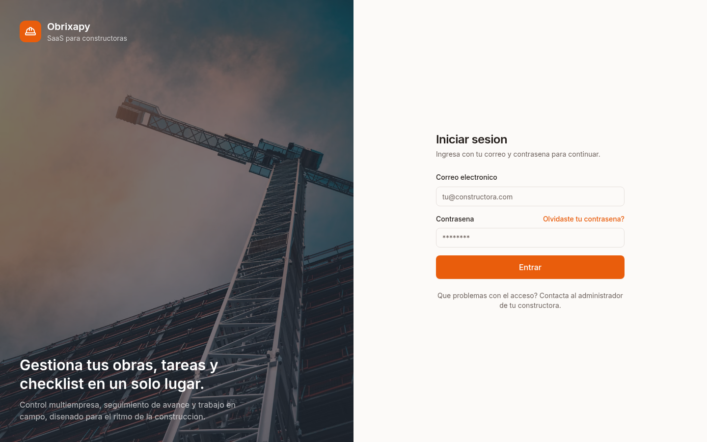
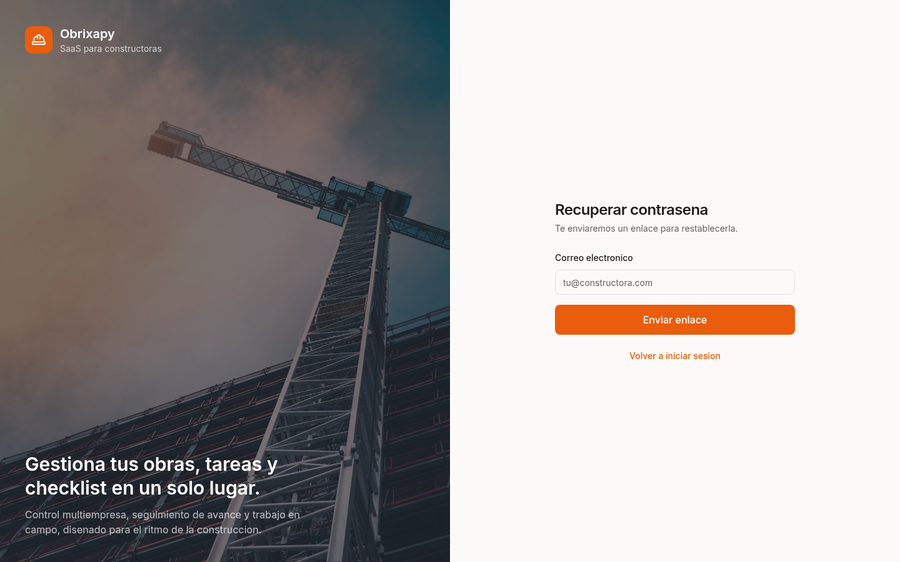
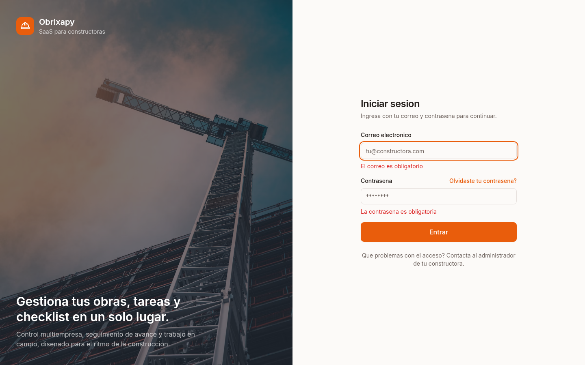
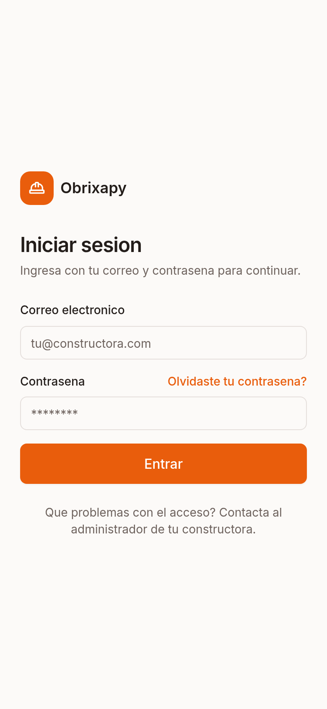
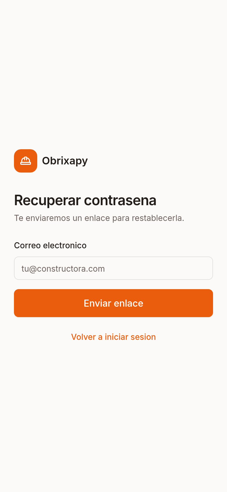

# PR: Frontend MVP de Obrixapy (`emergent/frontend-mvp` → `main`)

Implementación del frontend MVP de **Obrixapy** siguiendo `docs/EMERGENT_FRONTEND.md`,
`docs/FRONTEND_API_CONTRACT.md` y `docs/ARCHITECTURE.md`. Todo el trabajo vive dentro
de `frontend/`. No se modifica `backend/`, `deploy/` ni las migraciones.

Supabase se usa **solo para autenticación**; todos los datos de negocio se consumen
desde la API FastAPI (`https://api.obrixapy.online/api`). No se inventan endpoints ni
se usan datos simulados en producción.

---

## 1. Funciones y rutas implementadas

### Autenticación (Supabase)
- Login con `signInWithPassword`, persistencia y refresco de sesión.
- Recuperación de contraseña (`resetPasswordForEmail`) y pantalla para definir la
  nueva contraseña.
- `onAuthStateChange` con limpieza total de caché al cerrar sesión.
- Estados de cuenta: pendiente de activación, bloqueada y error de verificación.

### Cliente HTTP tipado (central)
- `Authorization: Bearer <access_token>` en cada petición.
- Ante `401`: un solo refresh + reintento; si persiste, cierre de sesión.
- `403` sin reintentos (empresa/acceso). Mapeo uniforme de `400/403/404/409/422`,
  errores de validación y errores de red.
- Sin `fetch` disperso en componentes.

### Multiempresa y permisos
- Selector de constructora basado **solo en membresías activas**.
- Permisos de UI por rol (`owner/admin/engineer`, `supervisor`, `worker/transport`,
  `warehouse/viewer`, `platform_admin`), derivados de `/v1/auth/me` (MySQL).

### Pantallas
- **Resumen**: métricas de obras + accesos rápidos.
- **Obras**: lista con búsqueda, filtro por estado, paginación, alta y edición.
- **Detalle de obra** con pestañas: Resumen, Niveles, Tareas y Checklist. Pestañas
  Planos/Inventario/Personal/Archivos/Reportes/Historial deshabilitadas.
- **Niveles**: alta y edición (según rol).
- **Tareas**: filtros (estado, tipo, nivel), alta/edición y cambio rápido de estado.
- **Checklist**: agrupado por etapa, filtro por estado y barra de avance (`/progress`).
- **Plataforma** (solo platform admin): empresas, planes y membresías.
- **Perfil**: nombre, correo, rol, empresa activa, estado de sesión y membresías.

### Rutas

| Ruta | Descripción |
|---|---|
| `/login` | Inicio de sesión |
| `/recuperar` | Recuperación de contraseña |
| `/restablecer` | Definir nueva contraseña |
| `/` | Resumen |
| `/obras` | Lista de obras |
| `/obras/:id` | Detalle de obra (pestañas) |
| `/tareas` | Selector de obra → Tareas |
| `/checklist` | Selector de obra → Checklist |
| `/plataforma` | Panel de plataforma (platform admin) |
| `/perfil` | Perfil |
| `/mas` | Menú adicional (móvil) |
| `/inventario` `/planos` `/elongaciones` `/personal` `/reportes` `/configuracion` | `Próximamente` |

### Endpoints consumidos (del contrato)
`GET /v1/auth/me`; `GET/POST/PATCH /v1/platform/plans`, `/v1/platform/companies`,
`/v1/platform/companies/{id}/memberships`, `PATCH /v1/platform/memberships/{id}`;
`GET/POST/PATCH` de `projects`, `levels`, `tasks` y `checklist`, y
`GET .../checklist/progress`.

---

## 2. Resultados de lint, pruebas y build

Ejecutado en `frontend/` con Node 20 / npm 10:

- `npm run lint` → **0 errores** (2 warnings de `react-refresh` en componentes
  shadcn `button`/`badge`, esperados por exportar variantes junto al componente).
- `npm run test` → **6 archivos / 20 pruebas, todas OK** (cliente HTTP con 401/403/422
  y red, permisos por rol, guard de rutas, login y validación, selector de empresa).
- `npm run build` → **OK** (`tsc -b` sin errores + build de Vite a `dist/`).

---

## 3. Capturas

### Escritorio

### Móvil

> Las capturas de pantallas internas (obras, tareas, checklist) se verificarán con una
> sesión manual del propietario, ya que no se dispone de credenciales de prueba.

---

## 4. Variables de entorno necesarias (sin secretos)

Definir en `frontend/.env.local` (no versionado). Ver `frontend/.env.example`.

- `VITE_APP_NAME=Obrixapy`
- `VITE_API_BASE_URL=https://api.obrixapy.online/api`
- `VITE_SUPABASE_URL=<Project URL>`
- `VITE_SUPABASE_PUBLISHABLE_KEY=<publishable key>`

No se utilizan `service_role`, secret keys ni credenciales de MySQL. La clave
publishable puede residir en el navegador.

### Configuración posterior al despliegue
1. Añadir la URL pública a las Redirect URLs de Supabase Auth.
2. Añadir la URL a `CORS_ORIGINS` en `/opt/constructora/app.env`.
3. Recrear el contenedor de la API.
4. Probar login, refresh, cambio de empresa y cierre de sesión.

---

## 5. Limitaciones y funciones `Próximamente`

Sin endpoint publicado en el contrato actual (se muestran como `Próximamente`, sin
datos simulados): Inventario, Planos, Archivos, Personal, Elongaciones, Reportes,
Notificaciones y las pestañas de obra correspondientes.

Acciones rápidas móviles sin API: **Escanear QR** y **Registrar movimiento**.

Notas:
- "Mis tareas" y "Checklist" globales operan seleccionando una obra (el contrato expone
  esos recursos por proyecto).
- No hay selector de responsables porque aún no existe endpoint para listar usuarios.
- Los nombres de campos de `/v1/auth/me` (membresías) y de algunas entidades se asumen
  según el contrato; se validarán con datos reales del propietario.

---

## 6. Entrega

- Rama: `emergent/frontend-mvp`. PR hacia `main`, **sin fusionar automáticamente**.
- No se incluyen secretos ni tokens en código, mensajes, logs ni capturas.
